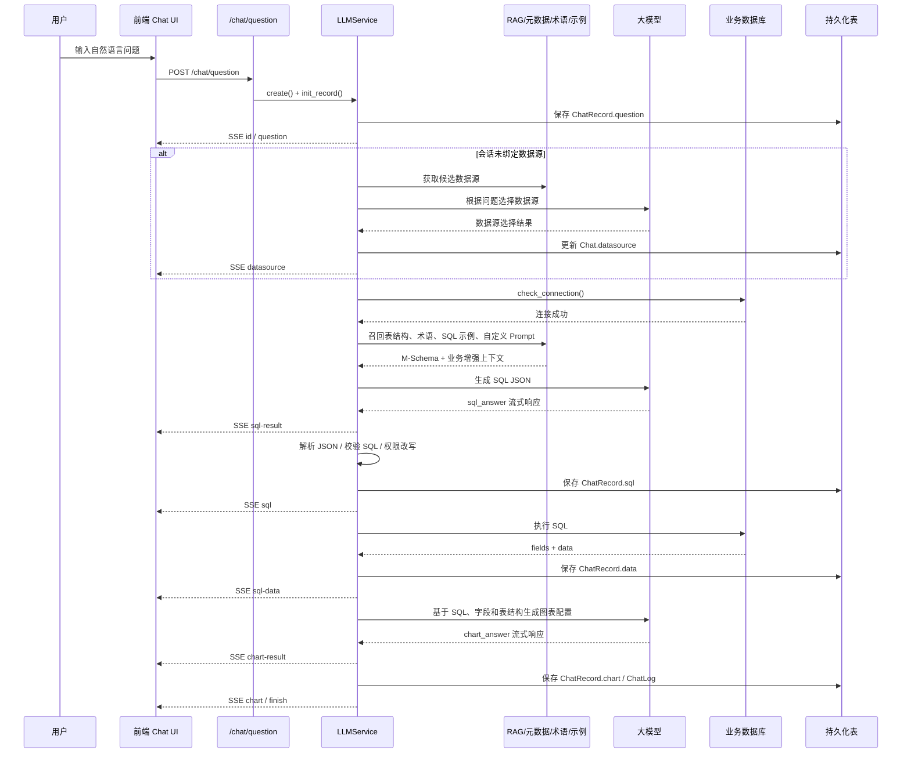

# SQLBot 架构说明：智能问数从查询到结果的流转原理

本文档说明 SQLBot 作为「智能问数 / ChatBI / Text-to-SQL」系统的实现原理，重点解释用户从自然语言提问开始，到最终拿到 SQL、查询数据和图表结果的完整链路。

## 1. SQLBot 的系统定位

SQLBot 不是简单把用户问题直接发给大模型，而是围绕结构化数据问答构建了一条完整链路：

1. 前端接收自然语言问题；
2. 后端创建聊天记录；
3. 选择或确认数据源；
4. 基于问题召回相关表结构、术语、SQL 示例、自定义 Prompt；
5. 拼装强约束 Prompt；
6. 调用大模型生成 SQL；
7. 校验模型输出、校验 SQL 安全性；
8. 按数据权限改写 SQL；
9. 连接真实数据源执行查询；
10. 保存查询结果；
11. 再调用大模型生成图表配置；
12. 通过 SSE 流式返回给前端展示。

一句话概括：**SQLBot 用 RAG 找到正确的数据上下文，用 Prompt 约束大模型生成 SQL，用后端做权限、安全、执行和可视化编排。**

## 2. 总体架构

SQLBot 的总体架构可以理解为「前端交互层 + 后端接口层 + 智能问数编排层 + 知识增强层 + 模型服务层 + 数据执行层 + 持久化与审计层」。其中最核心的是 `LLMService`，它把大模型、数据源、权限、Prompt、SQL 执行和图表生成串成一条完整的问数流水线。

### 2.1 分层架构视图

```mermaid
flowchart TB
    User([用户]) --> Web[前端交互层<br/>Chat UI / 图表展示 / 流式渲染<br/><code>frontend/src/views/chat</code><br/><code>frontend/src/api/chat.ts</code>]

    Web -->|POST /chat/question<br/>fetchStream / SSE| API[后端接口层<br/>FastAPI Router / 权限校验 / 快捷命令解析<br/><code>backend/apps/chat/api/chat.py</code>]

    API -->|创建 ChatRecord<br/>创建并启动 LLMService| Orchestrator[智能问数 Agent 编排层<br/>任务规划 / 步骤调度 / 流式输出 / 异常处理<br/><code>backend/apps/chat/task/llm.py</code>]

    Orchestrator --> Context[上下文与知识增强层]
    Orchestrator --> Model[大模型服务层]
    Orchestrator --> DBExec[数据执行层]
    Orchestrator --> Store[持久化与审计层]

    subgraph Context[上下文与知识增强层]
        DSSelect[数据源选择<br/><code>select_datasource()</code><br/><code>datasource/embedding/ds_embedding.py</code>]
        Schema[M-Schema 表结构构造<br/><code>get_table_schema()</code><br/><code>datasource/crud/datasource.py</code>]
        Embedding[Embedding 召回<br/>表/数据源/术语/SQL 示例相似度<br/><code>apps/ai_model/embedding.py</code>]
        Terms[术语库召回<br/><code>filter_terminology_template()</code><br/><code>terminology/curd/terminology.py</code>]
        Training[SQL 示例召回<br/><code>filter_training_template()</code><br/><code>data_training/curd/data_training.py</code>]
        CustomPrompt[自定义 Prompt<br/><code>filter_custom_prompts()</code><br/><code>sqlbot_xpack/custom_prompt</code>]
        History[历史上下文<br/>最近 N 轮 ChatLog messages<br/><code>init_messages()</code>]
    end

    subgraph Model[大模型服务层]
        Factory[模型工厂<br/>读取模型配置 / 创建 ChatModel<br/><code>ai_model/model_factory.py</code>]
        LLM[OpenAI 兼容模型<br/>vLLM / Azure / 其他兼容服务<br/><code>ai_model/openai/llm.py</code>]
        Prompt[Prompt 模板<br/>SQL / 图表 / 分析 / 预测 / 权限改写<br/><code>templates/template.yaml</code><br/><code>templates/sql_examples/*.yaml</code><br/><code>apps/template/*</code>]
        Factory --> LLM
        Prompt --> LLM
    end

    subgraph DBExec[数据执行层]
        Permission[权限处理<br/>字段权限 / 行级权限 / SQL 改写<br/><code>datasource/crud/permission.py</code><br/><code>generate_filter()</code>]
        Guard[SQL 安全校验<br/>只允许查询类 SQL<br/><code>check_sql_read()</code>]
        Executor[SQL 执行与结果格式化<br/><code>exec_sql()</code><br/><code>apps/db/db.py</code>]
        Sources[(业务数据源<br/>MySQL / PostgreSQL / Oracle<br/>SQL Server / ClickHouse / ES / Hive 等)]
        Permission --> Guard --> Executor --> Sources
    end

    subgraph Store[持久化与审计层]
        Chat[(chat<br/>会话 / 数据源 / 标题<br/><code>Chat</code>)]
        Record[(chat_record<br/>问题 / SQL / 数据 / 图表 / 错误<br/><code>ChatRecord</code>)]
        Log[(chat_log<br/>Prompt / 模型响应 / 耗时 / token<br/><code>ChatLog</code>)]
        Meta[(CoreDatasource/CoreTable/CoreField<br/>数据源 / 表 / 字段 / 注释 / embedding)]
        Crud[聊天持久化方法<br/><code>chat/curd/chat.py</code>]
    end

    Orchestrator -->|SSE: id/question/sql-result/sql-data/chart/finish/error| Web
```

> 如果当前 Markdown 渲染器不支持 Mermaid，可以把上图理解为：所有请求先进入 `chat.py`，再由 `LLMService` 统一编排；`LLMService` 同时访问模型、元数据、权限、数据库执行器和持久化模块，最后通过 SSE 把中间状态和最终结果持续推回前端。

### 2.2 一次智能问数的运行时链路



### 2.3 各层职责说明

| 层级 | 核心文件 / 模块 | 职责 |
| --- | --- | --- |
| 前端交互层 | `frontend/src/views/chat/`、`frontend/src/api/chat.ts` | 提交用户问题，消费 SSE 流，展示 SQL、数据表、图表、分析和错误信息。 |
| 后端接口层 | `backend/apps/chat/api/chat.py` | 暴露 `/chat/question`、分析、预测、推荐问题等接口；解析快捷命令；创建问数任务。 |
| 智能问数编排层 | `backend/apps/chat/task/llm.py` | 核心调度器，负责数据源选择、上下文召回、SQL 生成、权限改写、执行、图表生成和错误处理。 |
| Prompt 模板层 | `backend/templates/template.yaml`、`backend/templates/sql_examples/*.yaml`、`backend/apps/template/` | 定义 Text-to-SQL、图表、分析、预测、权限改写等 Prompt 规则，适配不同数据库方言。 |
| 知识增强层 | `backend/apps/datasource/embedding/`、`apps/terminology/`、`apps/data_training/`、自定义 Prompt | 将表结构、业务术语、SQL 示例、样例数据和历史上下文注入模型输入。 |
| 大模型服务层 | `backend/apps/ai_model/model_factory.py`、`backend/apps/ai_model/openai/llm.py` | 屏蔽模型供应商差异，统一以 LangChain ChatModel 方式流式调用模型。 |
| 数据源元数据层 | `backend/apps/datasource/crud/datasource.py`、`CoreDatasource/CoreTable/CoreField` | 管理数据源连接配置，维护表字段元数据、自定义注释、表关系和 Embedding。 |
| 数据执行层 | `backend/apps/db/db.py`、`backend/apps/db/db_sql.py` | 连接多种数据库，执行只读 SQL，格式化字段和数据，处理数据库方言差异。 |
| 权限与安全层 | `backend/apps/datasource/crud/permission.py`、`check_sql_read()` | 控制会话访问、工作空间隔离、字段权限、行级权限、只读 SQL 校验和查询行数限制。 |
| 持久化与审计层 | `chat`、`chat_record`、`chat_log` | 保存会话、问题、SQL、数据、图表、模型输入输出、token 用量、耗时和错误。 |

### 2.4 架构中的核心闭环

SQLBot 的架构不是单向调用，而是一个不断校验和增强的闭环：

```text
用户问题
  → 召回相关数据上下文
  → 生成 SQL
  → 后端校验 SQL
  → 注入权限规则
  → 执行真实查询
  → 用查询结果生成图表
  → 保存日志和结果
  → 支持后续追问、分析、预测、重新生成
```

这个闭环带来几个关键收益：

- **准确性**：模型不是凭空生成 SQL，而是基于 M-Schema、术语、样例和历史上下文生成；
- **可控性**：SQL 执行前会经过 JSON 解析、只读校验、权限改写和连接校验；
- **可追踪**：每次模型调用和本地操作都会写入 `ChatLog`；
- **可扩展**：模型、数据库方言、Prompt 模板、权限逻辑、图表生成都可以独立扩展；
- **体验好**：通过 SSE 逐步返回 `sql-result`、`sql`、`sql-data`、`chart` 等事件，用户可以实时看到进度。

### 2.5 代码功能模块速查

如果把 SQLBot 看成一个面向数据库问答的轻量级 Agent，那么 `LLMService` 就是 Agent 的编排器，其他目录分别承担「入口接收、上下文召回、模型调用、工具执行、记忆沉淀、结果展示」等职责。下面按项目目录结构展示关键代码位置和作用。

```text
SQLBot/
├── frontend/                                      # 前端工程：聊天页面、数据源管理、系统配置、图表展示
│   └── src/
│       ├── api/
│       │   ├── chat.ts                            # 智能问数前端 API：调用 /chat/question，发起 fetchStream，定义 Chat/ChatRecord 类型
│       │   ├── datasource.ts                      # 数据源相关接口：数据源列表、配置、同步等前端调用
│       │   ├── training.ts                        # SQL 示例 / 数据训练前端接口
│       │   ├── recommendedApi.ts                  # 推荐问题相关前端接口
│       │   └── assistant.ts                       # 助手 / 嵌入式应用相关接口
│       ├── views/
│       │   ├── chat/                              # 智能问数聊天主页面：提交问题、消费 SSE、展示 SQL/图表/分析结果
│       │   │   ├── component/                     # 聊天结果组件：基础图表、表格、G2 图表封装
│       │   │   │   └── charts/                    # 前端图表渲染：Table、Line、Bar、Column、Pie 等
│       │   │   └── typed.ts                       # 聊天页面相关类型定义
│       │   ├── ds/                                # 数据源配置页面：管理数据库连接、表字段选择、自定义注释
│       │   └── dashboard/                         # 仪表板相关页面，与问数结果可视化能力相关
│       ├── stores/                                # 前端状态管理：用户、助手、聊天配置等
│       └── utils/request.ts                       # 前端请求封装：普通 HTTP 与流式请求能力
│
├── backend/                                       # 后端工程：FastAPI + SQLModel + LangChain + 多数据库执行
│   ├── main.py                                    # FastAPI 应用启动入口
│   ├── apps/
│   │   ├── api.py                                 # 后端路由聚合入口：挂载 chat、datasource、system 等模块
│   │   │
│   │   ├── chat/                                  # 智能问数核心模块
│   │   │   ├── api/
│   │   │   │   └── chat.py                        # 问数 HTTP 入口：/chat/question、分析、预测、推荐问题、记录数据查询
│   │   │   ├── task/
│   │   │   │   └── llm.py                         # Agent 编排核心：LLMService，串联数据源选择、RAG、SQL 生成、执行、图表生成
│   │   │   ├── models/
│   │   │   │   └── chat_model.py                  # Chat、ChatRecord、ChatLog、ChatQuestion 模型，以及 Prompt 拼装方法
│   │   │   └── curd/
│   │   │       └── chat.py                        # 问数结果持久化：保存问题、SQL、数据、图表、日志、错误、标题
│   │   │
│   │   ├── datasource/                            # 数据源与元数据模块
│   │   │   ├── api/
│   │   │   │   ├── datasource.py                  # 数据源管理接口：创建、更新、同步、测试连接等
│   │   │   │   ├── table_relation.py              # 表关系维护接口：为多表 JOIN 提供关系信息
│   │   │   │   └── recommended_problem.py         # 数据源推荐问题接口
│   │   │   ├── crud/
│   │   │   │   ├── datasource.py                  # 数据源核心逻辑：同步表字段、构造 M-Schema、获取样例数据
│   │   │   │   ├── table.py                       # 表元数据维护：保存表 embedding、数据源 embedding、同步表信息
│   │   │   │   ├── field.py                       # 字段元数据维护：字段选择、自定义注释、字段更新
│   │   │   │   ├── permission.py                  # 权限逻辑：字段权限、行级权限、普通用户判断
│   │   │   │   └── row_permission.py              # 行级权限配置与查询
│   │   │   ├── embedding/
│   │   │   │   ├── table_embedding.py             # 表召回：计算问题与表结构 embedding 相似度，取 Top N 表
│   │   │   │   ├── ds_embedding.py                # 数据源召回：多数据源场景下按 embedding 召回候选数据源
│   │   │   │   └── utils.py                       # 向量相似度工具：cosine_similarity
│   │   │   ├── models/
│   │   │   │   └── datasource.py                  # CoreDatasource、CoreTable、CoreField 等数据源元数据模型
│   │   │   └── utils/                             # 数据源辅助工具：Excel、加密、数据源工具函数等
│   │   │
│   │   ├── terminology/                           # 术语库模块：提升自然语言到业务口径的映射能力
│   │   │   ├── api/terminology.py                 # 术语管理接口
│   │   │   ├── curd/terminology.py                # 术语召回：关键词匹配 + embedding 召回 + 同义词合并 + XML Prompt 包装
│   │   │   └── models/terminology_model.py        # 术语模型：主词、其他词、描述、数据源范围、启用状态、embedding
│   │   │
│   │   ├── data_training/                         # SQL 示例 / 数据训练模块：为 Text-to-SQL 提供 few-shot 示例
│   │   │   ├── api/data_training.py               # SQL 示例管理接口
│   │   │   ├── curd/data_training.py              # SQL 示例召回：包含匹配 + embedding 相似度召回 + XML Prompt 包装
│   │   │   └── models/data_training_model.py      # 数据训练模型：问题、建议答案/SQL、数据源、高级应用、embedding
│   │   │
│   │   ├── ai_model/                              # 大模型与 embedding 模型适配层
│   │   │   ├── model_factory.py                   # LLM 工厂：读取默认模型配置，创建 OpenAI/vLLM/Azure 等 ChatModel
│   │   │   ├── llm.py                             # LLM 抽象或公共逻辑
│   │   │   ├── embedding.py                       # EmbeddingModelCache：加载并缓存本地 HuggingFace embedding 模型
│   │   │   └── openai/llm.py                      # OpenAI 兼容 ChatModel 封装，支持流式输出和 reasoning 内容处理
│   │   │
│   │   ├── template/                              # Prompt 生成器代码：把模板、问题、schema、术语等拼成最终 Prompt
│   │   │   ├── template.py                        # YAML 模板加载入口：读取基础模板和数据库方言模板
│   │   │   ├── generate_sql/generator.py          # SQL 生成 Prompt 片段
│   │   │   ├── generate_chart/generator.py        # 图表生成 Prompt 片段
│   │   │   ├── generate_analysis/generator.py     # 智能分析 Prompt 片段
│   │   │   ├── generate_predict/generator.py      # 数据预测 Prompt 片段
│   │   │   ├── generate_dynamic/generator.py      # 动态数据源 SQL 改写 Prompt
│   │   │   ├── generate_guess_question/generator.py # 推荐问题生成 Prompt
│   │   │   ├── select_datasource/generator.py     # 数据源选择 Prompt
│   │   │   └── filter/generator.py                # 权限 SQL 改写 Prompt
│   │   │
│   │   ├── db/                                    # 多数据库连接与执行工具
│   │   │   ├── db.py                              # SQL 执行核心：连接数据库、只读校验、执行查询、结果格式化
│   │   │   ├── db_sql.py                          # 获取表、字段、版本的数据库方言 SQL
│   │   │   ├── constant.py                        # 数据库类型枚举、方言标识符、连接方式配置
│   │   │   ├── engine.py                          # 内部 PostgreSQL / Excel 引擎配置
│   │   │   └── es_engine.py                       # Elasticsearch 查询适配
│   │   │
│   │   ├── system/                                # 系统管理模块
│   │   │   ├── api/aimodel.py                     # 大模型配置接口
│   │   │   ├── crud/aimodel_manage.py             # 大模型配置管理：模型地址、API Key、默认模型等
│   │   │   ├── crud/assistant.py                  # 助手相关数据源和配置获取
│   │   │   ├── crud/assistant_manage.py           # 助手管理逻辑
│   │   │   └── models/system_model.py             # 用户、模型、助手等系统模型
│   │   │
│   │   ├── dashboard/                             # 仪表板模块：查询结果可视化和仪表板能力
│   │   ├── mcp/                                   # MCP / 外部工具调用入口：让外部系统调用 SQLBot 问数能力
│   │   └── settings/                              # 系统参数配置接口与模型
│   │
│   ├── common/                                    # 后端公共基础设施
│   │   ├── core/
│   │   │   ├── config.py                          # 全局配置：embedding 开关、Top N、相似度阈值、SQL 行数限制等
│   │   │   ├── db.py                              # SQLBot 自身元数据库连接
│   │   │   ├── deps.py                            # FastAPI 依赖：当前用户、当前助手、数据库 Session 等
│   │   │   ├── security.py                        # 认证安全相关工具
│   │   │   └── response_middleware.py             # 响应处理中间件
│   │   ├── utils/
│   │   │   ├── embedding_threads.py               # embedding 异步生成线程：术语、训练样例、表、数据源 embedding
│   │   │   ├── data_format.py                     # 查询结果格式化：大数字、字段名、Pandas/Markdown 转换
│   │   │   ├── command_utils.py                   # 快捷命令解析：/regenerate、/analysis、/predict
│   │   │   ├── utils.py                           # 通用工具：JSON 提取、模型参数处理、日志工具等
│   │   │   └── aes_crypto.py                      # 数据源密码等敏感信息加解密
│   │   └── audit/                                 # 操作日志和审计能力
│   │
│   ├── templates/                                 # YAML Prompt 模板文件
│   │   ├── template.yaml                          # 通用 Prompt：SQL 生成规则、安全限制、输出 JSON 格式、图表规则
│   │   └── sql_examples/                          # 各数据库方言模板：MySQL、PostgreSQL、Oracle、ClickHouse、Hive 等
│   │       ├── MySQL.yaml                         # MySQL 方言规则和示例
│   │       ├── PostgreSQL.yaml                    # PostgreSQL 方言规则和示例
│   │       ├── Oracle.yaml                        # Oracle 方言规则和示例
│   │       ├── ClickHouse.yaml                    # ClickHouse 方言规则和示例
│   │       └── ...                                # 其他数据库方言模板
│   │
│   └── alembic/                                   # 数据库迁移脚本：chat、chat_record、embedding、权限等表结构变更
│
├── g2-ssr/                                        # 服务端图表渲染：MCP 或图片返回场景生成图表图片
│   ├── app.js                                     # 图表渲染服务入口
│   └── charts/                                    # G2 图表类型实现：bar、line、pie、column 等
│
├── sqlbot-assistant-demo.html                     # 助手嵌入示例：演示外部页面如何集成 SQLBot
├── docker-compose.yaml                            # Docker Compose 部署入口
├── Dockerfile                                     # SQLBot 镜像构建文件
└── README.md                                      # 项目介绍与快速开始
```

从这个结构看，最值得优先理解的是下面几条主线：

```text
前端提问链路：
frontend/src/api/chat.ts
  → backend/apps/chat/api/chat.py
  → backend/apps/chat/task/llm.py

RAG 召回链路：
LLMService.init_messages()
  → datasource/crud/datasource.py        # 表结构 / M-Schema
  → terminology/curd/terminology.py      # 术语
  → data_training/curd/data_training.py  # SQL 示例
  → datasource/embedding/*.py            # 表 / 数据源 embedding

SQL 生成执行链路：
chat/models/chat_model.py                # Prompt 拼装
  → ai_model/model_factory.py            # 创建 LLM
  → LLMService.generate_sql()
  → db/db.py                             # SQL 安全校验与执行
  → chat/curd/chat.py                    # 保存 SQL 和查询结果

图表和分析链路：
LLMService.generate_chart()
  → template/generate_chart/
  → frontend/src/views/chat/component/charts/
  → LLMService.generate_analysis() / generate_predict()
```

### 2.6 按阅读顺序快速上手

建议按下面顺序阅读代码，能最快理解这个项目的 Agent 式问数流程：

1. `frontend/src/api/chat.ts`：了解前端如何调用 `/chat/question`。
2. `backend/apps/chat/api/chat.py`：了解请求如何进入后端任务。
3. `backend/apps/chat/task/llm.py`：重点阅读 `LLMService.run_task()`，这是主流程。
4. `backend/apps/chat/models/chat_model.py`：理解 `ChatQuestion` 如何拼装 SQL / 图表 / 分析 Prompt。
5. `backend/apps/datasource/crud/datasource.py`：理解 M-Schema 和表结构召回。
6. `backend/apps/terminology/curd/terminology.py` 与 `backend/apps/data_training/curd/data_training.py`：理解业务知识如何召回。
7. `backend/apps/ai_model/model_factory.py` 与 `backend/apps/ai_model/embedding.py`：理解模型和 embedding 如何接入。
8. `backend/apps/db/db.py`：理解 SQL 如何被安全校验并真实执行。
9. `backend/apps/chat/curd/chat.py`：理解每一步结果如何保存和审计。

### 2.7 类 Agent 视角下的模块映射

| Agent 概念 | SQLBot 中的实现 |
| --- | --- |
| Agent 主循环 / Planner | `LLMService.run_task()` 固定编排问数步骤。 |
| Memory | `Chat`、`ChatRecord`、`ChatLog`、历史 messages。 |
| Tools | 数据源选择、表结构召回、术语召回、SQL 示例召回、SQL 执行、图表生成。 |
| Retriever | 表 embedding、数据源 embedding、术语 embedding、SQL 示例 embedding。 |
| Prompt Builder | `ChatQuestion` 的各种 `*_question()` 方法和 `backend/apps/template/`。 |
| LLM Caller | `LLMFactory` 创建的 LangChain ChatModel。 |
| Tool Executor | `exec_sql()`、`check_connection()`、`get_table_schema()` 等后端函数。 |
| Guardrails | 权限装饰器、字段权限、行级权限、`check_sql_read()`、查询行数限制。 |
| Observation | SQL 执行结果、数据库错误、图表配置、日志。 |
| Final Answer | SSE 返回的 `sql`、`sql-data`、`chart`、`analysis-result`、`finish`。 |

## 3. 核心模块职责

| 模块 | 主要职责 |
| --- | --- |
| `frontend/src/api/chat.ts` | 前端聊天 API，调用 `/chat/question`，通过流式请求接收后端 SSE。 |
| `backend/apps/chat/api/chat.py` | 聊天接口层，接收问题、解析快捷命令、创建 `LLMService`、返回 `StreamingResponse`。 |
| `backend/apps/chat/task/llm.py` | 智能问数核心编排层，负责数据源选择、表召回、SQL 生成、执行、图表生成、异常处理。 |
| `backend/apps/chat/models/chat_model.py` | 会话、记录、日志、问题模型，以及 Prompt 拼装入口。 |
| `backend/apps/chat/curd/chat.py` | 聊天记录、SQL、数据、图表、日志等落库操作。 |
| `backend/apps/datasource/crud/datasource.py` | 数据源管理、表字段同步、M-Schema 生成、样例数据获取。 |
| `backend/apps/datasource/embedding/` | 表和数据源 Embedding 生成、相似度召回。 |
| `backend/apps/db/db.py` | 数据库连接、SQL 执行、只读 SQL 安全校验、结果格式化。 |
| `backend/apps/ai_model/model_factory.py` | 大模型工厂，统一创建 OpenAI 兼容、vLLM、Azure 等模型实例。 |
| `backend/templates/template.yaml` | 通用 Text-to-SQL Prompt 规则。 |
| `backend/templates/sql_examples/*.yaml` | 不同数据库方言的 SQL 规则和示例。 |

## 4. 关键数据模型

### 4.1 `Chat`

`Chat` 表示一次聊天会话，主要保存：

- `datasource`：会话绑定的数据源；
- `engine_type`：数据库类型；
- `brief`：会话标题；
- `origin`：来源，页面、MCP、助手等；
- `brief_generate`：标题是否由模型生成。

### 4.2 `ChatRecord`

`ChatRecord` 表示一次用户问答记录，贯穿整个问数生命周期：

- `question`：用户问题；
- `sql_answer`：模型生成 SQL 阶段的原始回答；
- `sql`：解析保存后的 SQL；
- `data`：SQL 查询结果；
- `chart_answer`：模型生成图表阶段的原始回答；
- `chart`：解析后的图表配置；
- `analysis`：智能分析结果；
- `predict` / `predict_data`：预测结果；
- `error`：异常信息；
- `finish`：本轮记录是否完成。

### 4.3 `ChatLog`

`ChatLog` 记录每一步的输入、输出、耗时、token 用量和错误状态。常见操作包括：

- `CHOOSE_DATASOURCE`：选择数据源；
- `CHOOSE_TABLE`：选择 / 召回表；
- `FILTER_TERMS`：召回术语；
- `FILTER_SQL_EXAMPLE`：召回 SQL 示例；
- `FILTER_CUSTOM_PROMPT`：召回自定义 Prompt；
- `GENERATE_SQL`：生成 SQL；
- `GENERATE_SQL_WITH_PERMISSIONS`：按权限改写 SQL；
- `EXECUTE_SQL`：执行 SQL；
- `GENERATE_CHART`：生成图表配置；
- `ANALYSIS`：智能分析；
- `PREDICT_DATA`：数据预测。

这些日志对审计、排查模型回答、优化 Prompt 非常重要。

## 5. 从问题到结果的完整流转

### 5.1 前端发起问题

前端通过 `frontend/src/api/chat.ts` 中的 `questionApi.add()` 调用：

```text
POST /chat/question
```

典型请求：

```json
{
  "chat_id": 123,
  "question": "最近 30 天各城市销售额趋势"
}
```

该接口使用流式响应，前端可以边接收边展示 SQL 生成、执行状态和图表结果。

### 5.2 后端接口入口

后端入口在 `backend/apps/chat/api/chat.py`：

```text
/question -> question_answer() -> question_answer_inner() -> stream_sql()
```

主要处理：

1. 校验当前用户是否有聊天权限；
2. 解析快捷命令：`/regenerate`、`/analysis`、`/predict`；
3. 普通问题进入 `stream_sql()`；
4. 创建 `LLMService`；
5. 创建 `ChatRecord`；
6. 启动后台任务；
7. 返回 `StreamingResponse`。

### 5.3 创建 `LLMService`

`LLMService.create()` 会初始化本次问数任务：

1. 读取默认或助手指定的大模型配置；
2. 通过 `LLMFactory.create_llm()` 创建 LangChain 模型；
3. 读取聊天参数，如是否限制行数、上下文历史轮数；
4. 根据 `chat_id` 找到会话；
5. 如果会话已有数据源，则加载数据源和数据库版本；
6. 读取历史 SQL 和图表生成日志，用作连续追问上下文。

### 5.4 创建记录并启动异步任务

`stream_sql()` 中会执行：

```text
llm_service.init_record()
llm_service.run_task_async()
return StreamingResponse(llm_service.await_result())
```

- `init_record()`：保存用户问题，生成 `ChatRecord`；
- `run_task_async()`：在线程池中运行 `run_task()`；
- `await_result()`：不断把后台任务产生的 chunk 通过 SSE 返回前端。

这种设计让用户能实时看到生成过程，而不是等待所有步骤结束。

## 6. `LLMService.run_task()` 主流程

`run_task()` 是智能问数的核心编排函数：

```text
返回 record id / question
  │
  ├─ 如果没有数据源：选择数据源
  ├─ 如果已有数据源：校验数据源仍可用
  ├─ 检查数据库连接
  ├─ 召回术语、SQL 示例、自定义 Prompt
  ├─ 召回相关表结构并生成 M-Schema
  ├─ 调用大模型生成 SQL
  ├─ 解析和校验 SQL JSON
  ├─ 根据权限规则改写 SQL
  ├─ 保存 SQL，并通过 SSE 返回
  ├─ 执行 SQL
  ├─ 保存查询数据，并通知前端
  ├─ 调用大模型生成图表配置
  ├─ 保存图表配置，并通过 SSE 返回
  ├─ 返回 finish
  └─ 异常时保存 error 并返回 error
```

## 7. 数据源选择

如果会话没有绑定数据源，会进入 `select_datasource()`。

逻辑如下：

1. 查询当前用户 / 助手可用的数据源列表；
2. 如果只有一个数据源，直接使用；
3. 如果有多个数据源，可先通过 Embedding 缩小候选范围；
4. 再让大模型根据用户问题选择最合适的数据源；
5. 将选择结果保存到 `Chat.datasource`。

选择成功后通过 SSE 返回：

```json
{
  "type": "datasource",
  "id": 1,
  "datasource_name": "销售数据源",
  "engine_type": "MySQL"
}
```

## 8. 表结构召回与 M-Schema

SQLBot 使用 `get_table_schema()` 从元数据中生成 M-Schema。

元数据来自数据源同步阶段，包括：

- 表名；
- 表注释 / 自定义注释；
- 字段名；
- 字段类型；
- 字段注释 / 自定义注释；
- 表关系。

生成示例：

```text
【DB_ID】 sales_db
【Schema】
# Table: orders, 订单表
[
(order_id: bigint, 订单 ID),
(city: varchar, 城市),
(amount: decimal, 销售额),
(created_at: datetime, 下单时间)
]
【Foreign keys】
orders.customer_id=customers.id
```

如果启用 `TABLE_EMBEDDING_ENABLED`，系统会：

1. 对用户问题生成向量；
2. 与每张表的 embedding 计算余弦相似度；
3. 选择 Top N 相关表；
4. 如果相关表存在外键关系，会补充关联表；
5. 将最终 M-Schema 放入 Prompt。

这样可以减少无关表干扰，提升 Text-to-SQL 准确率。

## 9. 业务知识召回

SQLBot 在生成 SQL 前会召回多类增强信息。

### 9.1 术语库

`filter_terminology_template()` 会根据问题召回业务术语。

例如：

```text
GMV = 支付金额总和，退款订单不计入
```

这些术语进入 Prompt 后，模型就能按业务口径生成 SQL。

### 9.2 SQL 示例 / 数据训练

`filter_training_template()` 会召回相似 SQL 示例。

它可以告诉模型：类似问题应该用哪些表、哪些字段、如何聚合、如何处理时间。

### 9.3 自定义 Prompt

`filter_custom_prompts()` 会注入管理员配置的额外规则，例如：

- 查询订单时排除测试订单；
- 某字段固定代表某个业务含义；
- 某类查询必须加固定过滤条件。

## 10. Prompt 如何构造

SQL 生成 Prompt 由 `ChatQuestion.sql_sys_question()` 和 `sql_user_question()` 构造。

内容来源包括：

- 通用模板：`backend/templates/template.yaml`；
- 数据库方言模板：`backend/templates/sql_examples/*.yaml`；
- 当前问题；
- 当前时间；
- 数据库引擎和版本；
- M-Schema；
- 样例数据；
- 术语；
- SQL 示例；
- 自定义 Prompt；
- 历史上下文；
- 上一次 SQL 执行错误；
- 是否需要生成会话标题。

模板强制要求模型返回 JSON：

```json
{
  "success": true,
  "sql": "SELECT ...",
  "tables": ["orders"],
  "chart-type": "line",
  "brief": "销售趋势"
}
```

并强约束：

- 只能生成查询 SQL；
- 不能编造表字段；
- SQL 必须符合当前数据库方言；
- 默认必须限制查询行数；
- 多表查询字段必须带表名或别名；
- SQL 标识符必须与 M-Schema 完全一致。

## 11. SQL 生成、校验和权限改写

`generate_sql()` 调用大模型流式生成 SQL 回答。后端边接收边通过 SSE 返回 `sql-result`。

模型完整回答会保存到 `ChatRecord.sql_answer`，同时写入 `ChatLog`。

之后 `check_sql()` 负责：

1. 从模型文本中提取 JSON；
2. 判断 `success`；
3. 提取 `sql` 和 `tables`；
4. 校验 SQL 非空。

如果当前用户是普通用户，或处于动态数据源场景，系统还会处理权限：

- `generate_filter()`：读取行级权限条件；
- `build_table_filter()`：让模型把权限条件注入 SQL；
- `generate_assistant_dynamic_sql()`：动态数据源场景中将表替换为子查询。

最终 SQL 保存到 `ChatRecord.sql`，并通过 SSE 返回 `type: sql`。

## 12. SQL 执行与安全控制

执行前，`backend/apps/db/db.py` 的 `exec_sql()` 会调用 `check_sql_read()` 做只读校验。

允许：

```text
SELECT, WITH, SHOW, DESCRIBE, DESC, EXPLAIN
```

拒绝：

```text
INSERT, UPDATE, DELETE, CREATE, DROP, ALTER, TRUNCATE,
MERGE, COPY, REPLACE, GRANT, REVOKE, USE, SET, CALL
```

同时使用 `sqlglot` 解析 SQL 语法树，识别写操作表达式。这是防止模型生成危险 SQL 的关键防线。

SQL 执行结果统一格式化为：

```json
{
  "fields": ["city", "amount"],
  "data": [
    {"city": "北京", "amount": 1000},
    {"city": "上海", "amount": 900}
  ],
  "sql": "base64 编码后的 SQL"
}
```

结果保存到 `ChatRecord.data`，并返回 SSE：

```json
{
  "type": "sql-data",
  "content": "execute-success"
}
```

前端随后可通过：

```text
GET /chat/record/{chat_record_id}/data
```

获取实际数据。

## 13. 图表生成

SQL 执行成功后，系统进入图表生成阶段：

1. 从 SQL 阶段模型返回中读取推荐 `chart-type`；
2. 根据 SQL 使用的表重新获取精简表结构；
3. 调用 `generate_chart()`；
4. 模型生成图表 JSON；
5. `check_save_chart()` 解析并规范化字段；
6. 保存到 `ChatRecord.chart`；
7. 通过 SSE 返回 `type: chart`。

图表阶段和 SQL 阶段分离，可以让 SQL 生成更专注于查询正确性，让图表生成更专注于可视化表达。

## 14. SSE 流式事件

常见 SSE 事件如下：

| `type` | 含义 |
| --- | --- |
| `id` | 当前聊天记录 ID。 |
| `question` | 当前问题。 |
| `datasource-result` | 数据源选择阶段的模型增量输出。 |
| `datasource` | 数据源已确定。 |
| `sql-result` | SQL 生成阶段的模型增量输出。 |
| `brief` | 会话标题。 |
| `sql` | 最终 SQL。 |
| `sql-data` | SQL 执行成功，数据已保存。 |
| `chart-result` | 图表生成阶段的模型增量输出。 |
| `chart` | 最终图表配置。 |
| `finish` | 本轮问答结束。 |
| `error` | 本轮问答失败。 |
| `analysis-result` | 智能分析增量输出。 |
| `predict-result` | 预测增量输出。 |
| `recommended_question` | 推荐问题结果。 |

## 15. 智能分析与预测

除普通问数外，SQLBot 还支持基于已有图表继续做分析和预测。

### 15.1 智能分析

链路大致为：

```text
POST /chat/record/{chat_record_id}/analysis
```

后端会读取原始图表字段和数据，召回术语、自定义分析 Prompt，然后调用大模型生成分析文本。

### 15.2 数据预测

预测链路类似，但使用预测 Prompt。模型输出预测数据 JSON 后，系统保存到预测记录，并可结合原图表配置展示预测结果。

## 16. 安全与权限设计

SQLBot 的安全控制是多层的：

1. **接口权限**：`/chat/question` 校验用户是否能访问当前会话；
2. **工作空间隔离**：数据源必须属于当前用户工作空间；
3. **字段权限**：构造 M-Schema 时过滤不可见字段；
4. **行级权限**：执行前根据权限规则改写 SQL；
5. **只读 SQL 校验**：执行前强制拒绝写操作；
6. **行数限制**：Prompt 要求默认限制查询数据量，保存结果时也会截断过大数据集；
7. **全链路日志**：每一步输入输出和错误都记录到 `ChatLog`。

## 17. 数据源元数据生命周期

创建或更新数据源时，系统会：

1. 保存连接配置；
2. 连接真实数据库获取表列表；
3. 同步表到 `CoreTable`；
4. 同步字段到 `CoreField`；
5. 支持用户维护表字段自定义注释；
6. 生成表和数据源 Embedding；
7. 问数时基于这些元数据生成 M-Schema。

其中表字段自定义注释非常关键。比如字段名是 `amt`，但注释写成「销售额」，模型才能更稳定地把用户的「销售额」映射到正确字段。

## 18. 为什么能实现智能问数

SQLBot 的智能问数能力来自以下组合：

1. **元数据约束**：模型只能看到有权限的表字段；
2. **RAG 召回**：按问题召回相关表、术语、SQL 示例；
3. **方言模板**：不同数据库有不同 SQL 规则；
4. **强 Prompt 约束**：要求 JSON 输出、只读 SQL、字段严格匹配；
5. **历史上下文**：支持连续追问；
6. **错误反馈**：重新生成时带上上次 SQL 执行错误；
7. **权限改写**：普通用户查询前注入行级过滤；
8. **执行前安全校验**：后端强制校验只读 SQL；
9. **真实执行闭环**：生成 SQL 后立即执行并保存结果；
10. **图表二次生成**：查询数据后再生成更准确的可视化配置。

## 19. 示例链路

用户输入：

```text
最近 30 天各城市销售额趋势
```

系统执行：

1. 保存问题到 `ChatRecord.question`；
2. 选择或确认销售数据源；
3. 召回 `orders` 等相关表；
4. 召回「销售额」相关术语；
5. 构造 M-Schema 和 Prompt；
6. 大模型生成 SQL JSON；
7. 校验 SQL 并保存；
8. 执行 SQL；
9. 保存查询数据；
10. 大模型生成折线图配置；
11. 返回 SQL、数据状态、图表配置；
12. 前端展示图表。

## 20. 二次开发关注点

| 目标 | 关注文件 |
| --- | --- |
| 新增模型供应商 | `backend/apps/ai_model/model_factory.py` |
| 调整 SQL 生成规则 | `backend/templates/template.yaml`、`backend/templates/sql_examples/*.yaml` |
| 新增数据库类型 | `backend/apps/db/constant.py`、`backend/apps/db/db.py`、`backend/apps/db/db_sql.py` |
| 优化表召回 | `backend/apps/datasource/embedding/`、`get_table_schema()` |
| 调整权限注入 | `backend/apps/datasource/crud/permission.py`、`LLMService.generate_filter()` |
| 增加问数后处理步骤 | `backend/apps/chat/task/llm.py` 的 `run_task()` |
| 调整 SSE 协议 | `LLMService.run_task()` 和前端聊天组件 |
| 优化前端展示 | `frontend/src/views/chat/`、`frontend/src/api/chat.ts` |

## 21. 总结

SQLBot 的核心链路是：**自然语言问题 → RAG 召回数据上下文 → 强约束 Prompt → 大模型生成 SQL → 后端校验与权限处理 → 数据库执行 → 大模型生成图表 → SSE 流式返回结果**。

它把大模型的自然语言理解能力、数据库元数据、业务知识、权限控制和真实查询执行结合起来，形成了一个可审计、可控、可扩展的智能问数系统。
